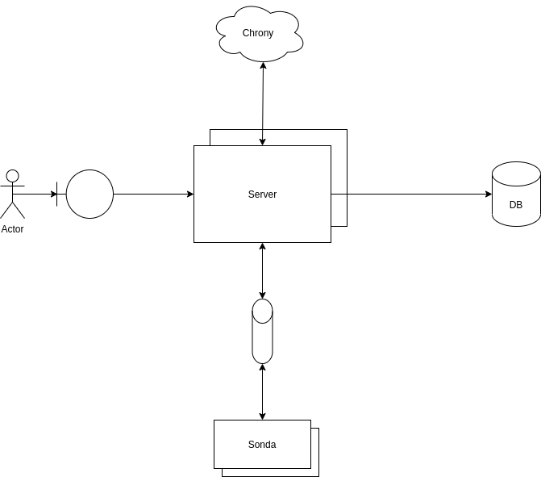
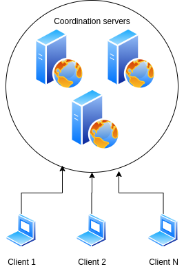

# Pladmed backend

####How to run
You can run everything through Docker:

- make start: Starts the server
- make debug: Starts the server and watch for logs
- make logs: See logs of the server
- make stop: Stops the server
- make test: Run the tests

Accessible (default) at http://localhost:5000/

####Configuración
Si se utiliza la base de datos incluída en el docker-compose, se deben configurar los parámetros de dicha base en el archivo `.env_database`:
```
MONGO_INITDB_DATABASE=<database-name:pladmed> #Nombre de la base de datos
MONGO_INITDB_ROOT_USERNAME=<database-root-user> #Usuario root para la utilizacion de la base
MONGO_INITDB_ROOT_PASSWORD=<database-password> #Contraseña del usuario
```
Luego, para configurar el servidor se deberá crear el archivo `.env_server`, conteniendo las siguientes variables de entorno:
```
PYTHONUNBUFFERED=1 #Necesario para enviar el log al container

DEBUG=1 #Nivel de debug
PORT=<app_port:5000> #Puerto utilizado
HOST=<app_host:0.0.0.0> #Host en el que corre la app 
FLASK_ENV=<development|production> #Indica el entorno de ejecución
FLASK_APP=main.py #Necesaria para iniciar la aplicación Flask

SECRET_KEY=<secret-key-for-tokens> #Clave secreta utilizada para generar los tokens

DATABASE=mongo

MONGO_USERNAME=<database-root-user> #Usuario root para la utilizacion de la base
MONGO_PASSWORD=<database-password> #Contraseña del usuario
MONGO_DATABASE=<database-name:pladmed> #Nombre de la base de datos
MONGO_HOST=<mongo-host:db> #Host de la base de datos
MONGO_PORT=<mongo-port:27017> #Puerto en el que corre la base de datos

LOG_FILE=server.log #Archivo de log
```

####Arquitectura
##### Robustez y características del sistema
En el diagrama se puede ver a grandes rasgos cómo funciona la robustez del sistema. Por un lado, tenemos los actores que pueden desencadenar eventos a través de un endpoint del sistema. Esto desencadena acciones en cualquiera de los nodos levantados (configurable a través de docker-compose), los cuales se conectan con MongoDB para la persistencia de datos y con Chrony para la sincronización de tiempos. En caso de corresponder, los servidores se comunicarán con las sondas mediante sockets.
 
##### Despliegue del sistema
Veamos entonces cómo es el despligue del sistema. Por un lado, tenemos los distintos clientes que correrán el frontend en su propio navegador a través de un servidor web. Además, cada uno de los clientes puede ejecutar su propia sonda mediante la instalación de la misma (Ver [documentación](https://github.com/fedefunes96/pladmed-client)).


En este caso, los "Coordination servers" son aquellos que ejecutan el servidor, coordinan los tiempos y las mediciones. Los disintos clientes serán que consultan los servidores a través del frontend, o las sondas.

##### Coordinación de tiempos
La coordinación de tiempos se realiza mediante Chrony, utilizándolo como cliente NTP para sincronizar el reloj. Además, el servidor funciona como servidor NTP para la sincronización de las sondas, de forma tan de no sobrecargar los servidores públicos.
Veamos entonces un diagrama de los distintos estratos de NTP y cómo encajan nuestros sistemas:
 
 
Por un lado, vemos que NTP está en un estrato p. Entonces, nuestro servidor será parte del estrato p+1. Gracias a que también funciona como servidor, las distintas sondas serán parte del estrato p+2.
 
####Endpoints 
Dentro de la carpeta `docs/endpoints` se encuentra el archivo .yaml necesario para correr en Swagger y ver los distintos endpoints con sus parámetros.