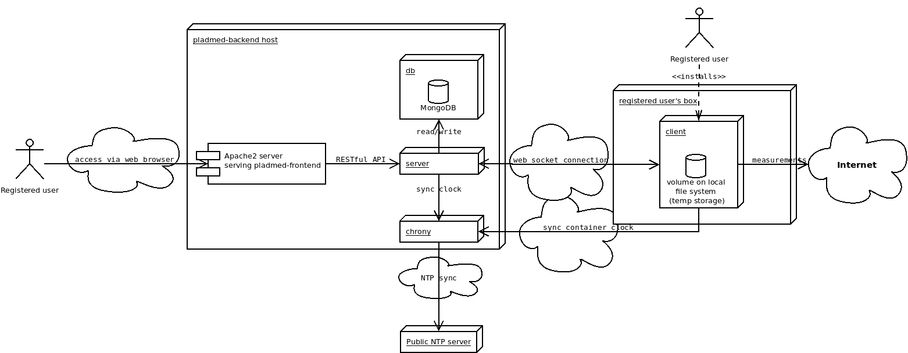

# Pladmed backend

[](https://travis-ci.com/fedefunes96/pladmed-backend)

[](https://codecov.io/gh/fedefunes96/pladmed-backend)

**How to run**
You can run everything through Docker:

- make start: Starts the server
- make debug: Starts the server and watch for logs
- make logs: See logs of the server
- make stop: Stops the server
- make test: Run the tests

Accessible (default) at http://localhost:5000/

#### Configuration

To configure the Mongo database that will run in a separate Docker container via docker-compose, a file named `.env_database` will need to be created at the repository's root level. This file will contain the environment variables for configuring the database container. See `.env_database.example` for the default values.

```
MONGO_INITDB_DATABASE=<database-name:pladmed> #Database name
MONGO_INITDB_ROOT_USERNAME=<database-root-user> #root user for this database
MONGO_INITDB_ROOT_PASSWORD=<database-password> #root user password
```

Similarly, to configure the server itself, a file named `.env_server` will need to exist at the root level. It will need to contain the following environment variables:

```
PYTHONUNBUFFERED=1 #Needed to send logs to container

DEBUG=1 #Debug level
PORT=<app_port:5000> #TCP port (internal to Docker where the server will listen for requests)
HOST=<app_host:0.0.0.0> #IP address, internal to Docker network, where the server will run
FLASK_ENV=<development|production> #Define execution environment
FLASK_APP=main.py #Required by Flask framework

SECRET_KEY=<secret-key-for-tokens> #Used to generate security tokens

DATABASE=mongo

MONGO_USERNAME=<database-root-user> #root user for connecting to database
MONGO_PASSWORD=<database-password> #root user password
MONGO_DATABASE=<database-name:pladmed> #Mongo database name
MONGO_HOST=<mongo-host:db> #Database host
MONGO_PORT=<mongo-port:27017> #Database service port

LOG_FILE=server.log #Log file location
```

##### Architecture and robustness considerations


In this diagram, the system's architectural focus on robustness can be appreciated. For starters, there's the actors who trigger events by sending messages against an instance of pladmed-backend. On the full system, this will be done by pladmed-frontend. Each instance of pladmed-backend will use MongoDB for persisting its data, and a Chrony server/client for time synchronization.

MongoDB was chosen because it's well suited for the unstructured nature of the operation results' data. It's simple to use, which speeds up development. Reliability can be achieved by using WriteConcern, and scalability and fault tolerance with replicas.

Regarding Chrony, it can act both as a client (for adjusting the server's clock) and as a server (to provide time to the probes in a scalable way). Clock drift is not critical to pladmed, since measurements deal with time differences. So NTP is good enough in this aspect.

The servers communicate with the probes via web sockets; this simplifies communication, since objects can be sent straight away and there is no need to design an internal protocol, or middleware. For scaling up, adding more servers and a publisher/subscriber broker (Redis, Kafka, RabbitMQ) is the way to go.

#### Class Diagram

[pladmed-backend class diagram](docs/class-diagram.md)

##### Deployment



This diagram depicts the recommended deployment strategy for the system as a whole.

Firstly, pladmed-frontend can be served via any web server (Apache2, nginx) so users can access it in their own browser across the Internet. On the other hand, those same users, or different ones, can run their own probes by installing them in their system (see [the probe documentation](https://github.com/fedefunes96/pladmed-client)) for details.

Secondly, each server will have three docker containers:

1. server: Runs a pladmed-backend instance, including a web server which will listen for HTTP requests from the frontend, and web socket connections from probes.
2. db: Runs a MongoDB database instance for persisting users, operations and their results.
3. chrony: Runs a Chrony client/server. Acts as an NTP client for pladmed-backend, and as an NTP server for probes.

##### Time synchronization

This is performed using [Chrony](https://github.com/mlichvar/chrony). A Chrony instance is ran inside its own Docker container, ideally in the same host and Docker network as pladmed-backend, using it as a client for adjusting the server's clock. Since a Chrony instance can act both as an NTP client and NTP server, it does so, acting as an NTP server to the probes, improving the system scalability and reducing the load on public NTP servers. Visually:


Assuming there's a public NTP server in the p stratum, then a pladmed-backend instance which sync with it will be in stratum (p+1). Since the same Chrony instance will act as an NTP server for the probes, all of them will be in stratum p+2. This is fine because probes measure relative times: clock drift doesn't affect them critically.
 
#### Endpoints / pladmed-backend web API documentation

Inside the  `docs/endpoints` directory, there's a .yaml [Swagger](https://swagger.io/tools/swagger-ui/) file which can be used for viewing and testing the web API endpoints.

Alternatively, in the same directory, there is a [Postman](https://www.postman.com/) collection, which can be imported and used in Postman.
