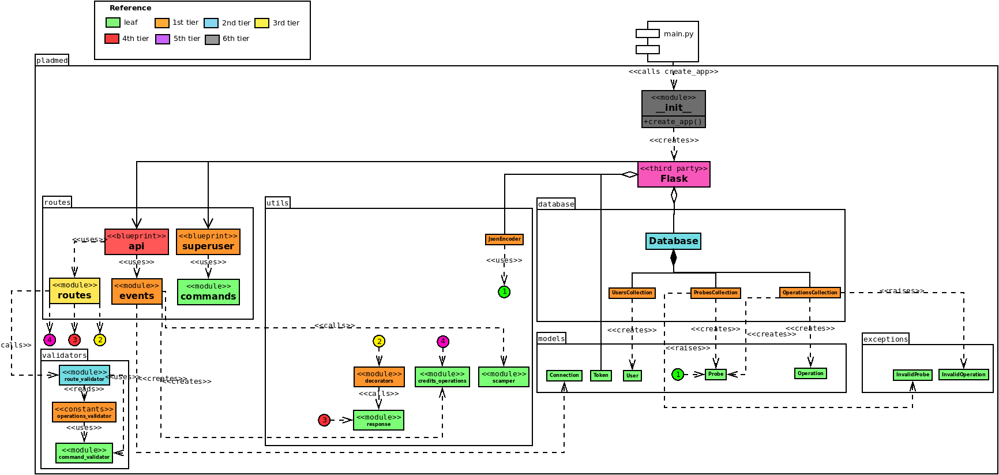

# Class diagram

In this diagram, the colored "tiers" represent the potential impact of changing a class or module. Leaf classes are those which do not depend on any other class, but changes in them will affect all classes in their path to the root. First tier classes are those which only depend on leaf classes. Second tier classes depend on at least one first tier class. Generalizing, an n-th tier class depends on at least one (n-1)-th tier class. The higher tier a class or module is, the less risky is changing it. Considering this, low tier classes should aim to have a higher test coverage. 

## Class responsibilities

### `pladmed` package

* **__init__ (module)**: Create and start Flask application.

### `pladmed.database` package

* **Database**: Abstract database initialization.

* **OperationsCollection**: Handle persistence and database lookup for pladmed.model.Operation instances.

* **ProbesCollection**: Handle persistence and database lookup for pladmed.model.Probe instances.

* **UsersCollection**: Handle persistence and database lookup for pladmed.model.User instances.

### `pladmed.exceptions` package

* **InvalidOperation**: Raised when an invalid pladmed.model.Operation instance is detected. This can happen, for example, if it missing the `probes` field, because an operation cannot exist outside the context of a probe (at least one probe must run it).

* **InvalidProbe**: Raised when an invalid pladmed.model.Probe instance is detected.

### `pladmed.models` package

* **Connection**: Represents a communication channel from a pladmed-backend instance to a single probe.

* **Operation**: Represents a measurement operation (traceroute/ping/dns), including its parameters, references to the probes that will run it, the credits it will cost, and the results. The latter will be set incrementally, as they are sent by the probe(s) to the server.

* **Probe**: Represents a probe capable of performing measurements, including a reference to the user who owns it, and its geographical location.

* **Token**: Represents a security token used by users or probes to authenticate against a pladmed-backend instance.

* **User**: Represents a user who will request measurements and results to a pladmed-backend instance. Handles authentication.

### `pladmed.routes` package

* **commands (module)**: Defines a Flask command for securely creating a superuser. For security reasons, this command has no associated endpoint, and can only be ran from inside the Docker container where pladmed-backend runs.

* **events (module)**: Defines handlers for each socket.io event which pladmed-backend can receive from the probes.

* **routes (module)**: Defines all web endpoints for a pladmed-backend instance. These are documented in `docs/endpoints`. Request validation and authentication via token are performed at this level.

### `pladmed.utils` package

* **credits_operations (module)**: Contains logic for calculating the cost in credits of a given operation.

* **decorators (module)**: Defines decorators for parsing user data from the security token in the web methods which require it.

* **encoders (module)**: JSON Serialization for web method responses.

* **response (module)**: HTTP code constants and a helper function for shortening HTTP error responses.

* **scamper (module)**: Wraps some Scamper tools which are used to decode results in a user-friendlier format.

### `pladmed.validators` package

* **command_validator (module)**: Defines a class hierarchy based on AnyValidator, so as to polymorphically validate different kinds of operation parameters.

* **operations_validator (module)**: Defines constants which model all possible parameters for each kind of operation (traceroute/ping/dns), and their allowed values and formats, for performing validation on them. Different classes from the hierarchy defined in `command_validator` are used for each kind of parameter.

* **route_validator (module)**: Defines logic for validating http routes, POST body arguments and query parameters in incoming HTTP requests.
  